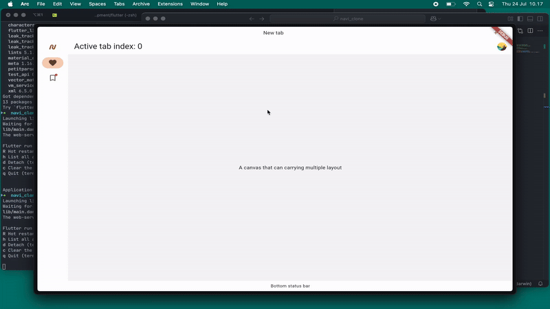

# navi_clone

A Flutter project for NAVI desktop app clone.

## Run the app

The flutter run commands:

```bash
# On web server
flutter run -d web-server --web-port 8080 --web-hostname 0.0.0.0

# On MacOS
flutter run -d macos

# On Windows
flutter run -d windows

# On Linux
flutter run -d linux
```

## Demo

<figure>
    
    <figcaption>An app snippet.</figcaption>
</figure>

## Getting Started

This project is a Flutter application.

A few resources to get you started:

- [Lab: Write your first Flutter app](https://docs.flutter.dev/get-started/codelab)
- [Cookbook: Useful Flutter samples](https://docs.flutter.dev/cookbook)

For help getting started with Flutter development, view the
[online documentation](https://docs.flutter.dev/), which offers tutorials,
samples, guidance on mobile development, and a full API reference.
